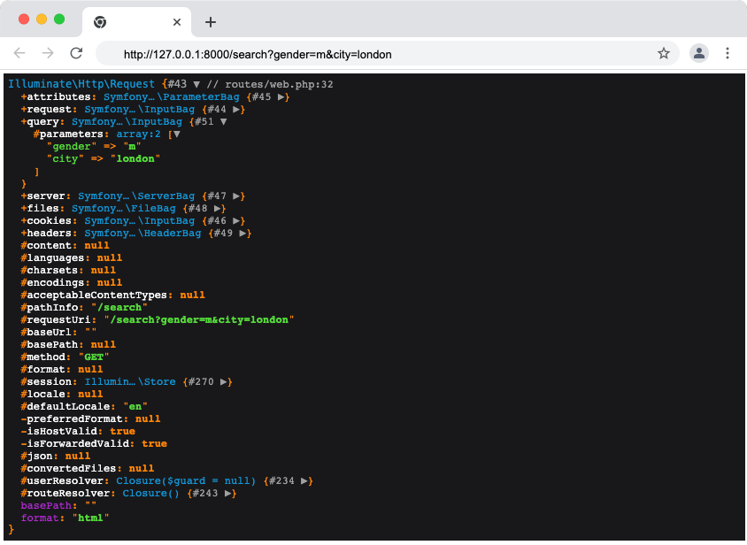
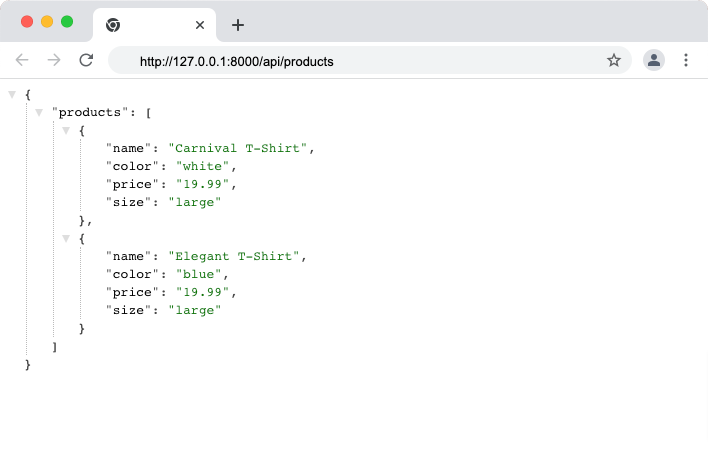

<p align="center"><a href="https://laravel.com" target="_blank"></a></p>

<p align="center">
<a href="https://travis-ci.org/laravel/framework"></a>
<a href="https://packagist.org/packages/laravel/framework"></a>
<a href="https://packagist.org/packages/laravel/framework"></a>
<a href="https://packagist.org/packages/laravel/framework"></a>
</p>

# Understand Laravel routing with examples 
This section will focus on some basics.

## Laravel Requirement

See all the requirements, for example, you need to have PHP version that is equal to or greater than 7.25. [See more on installation by visiting Laravel site](https://laravel.com/docs/7.x/installation).

I'm using Mac, the process will be different on Windows. Please visit [Laravel Installation Guide](https://laravel.com/docs/8.x/installation#installation-via-composer)

Once your system meets all the requirement, install [Composer](https://getcomposer.org/) as Laravel use this to manage its dependencies. 
 

Download the Laravel installer using Composer:

```
composer global require laravel/installer
```

Edit the bash profile by placing composer system-wide vendor bin directory in your $PATH so laravel executable can be located by the system. You can do this by placing this code in your bash_profile.

```
nano ~/.bash_profile
```

Add the code below to the file that is opened

```
export PATH="$PATH:$HOME/.composer/vendor/bin"
```

Update the the current terminal to detect the changes or open another terminal

```
source ~/.bash_profile
```


## Create a new project
Run the below command to create new project. project-name is the name in the command is the name of your project name or folder that Laravel will be installed.

```
laravel new the-project-name
```
Navigate to the the project you just created
```
cd project-name
```

## Run the project
```
php artisan serve
```

## Getting to know Laravel

Open up the foler that contains your Laravel project, you will see that there are lots of folder there. When you run the <code>php artisan serve</code>, the folder that holds the html can be found under resources/views.

Inside the views folder you will find a file 'welcome.blade.php', this is called blade template. This is the file that generate our view, the one we see on the homepage. Every blade template will have 'blade.php' extension. 

If you open this up, you will see that it just look like normal HTML file. You can change a piece of text and reload the page to view your changes. 

We will come back to view, but let's start with Routing.

### Routing
Expand the 'routes' folder, we are going to be working in the web.php for the most part. You will see that there is an api.php file as well this is used when creating an API project.

In the web.php file, we are going to be loading all our views and controllers. The route is what handles all the requests and return the views - accepts a request and redirect it to a function. 

```
Route::get('/', function () {
    return view('welcome');
});
```

The example above shows that the route accepts a get request with path of root directory ('/') and returns a welcome page view(callback). Another way of saying this is if the page is home (start page), return a page that is called welcome (welcome.blade.php). This is how we load a view.
> Note the welcome in the name of the file and the welcome in the view function parameter, this needs to match. No need to put '.blade.php'. 
Route will return whatever you put after the return statement, let's add another route to the current one and return a piece of html.

```
Route::get('/about', function () {
    return '<h2>About me</h2>';
});
```
> We are going to be using the ::get route method. Other router methods that are available are ::post, ::put, ::patch, ::delete, ::options, ::views, ::redirect and more.

If you navigate to http://127.0.0.1:8000/about, you will see the content we just added. Routes accept request and redirect it to appropriate function.

Routes comes with many default parameter however you can pass optional parameters to route. For instance, let's render our content as a plain text with the following code:
```
Route::get('/about', function () {
    return response('<h2>About me</h2>')
    ->header('Content-Type', 'text/plain');
});
```

Let's say we want to add custom values to the header, we can do it like so:
```
Route::get('/about', function () {
    return response('<h2>About me</h2>')
    ->header('Content-Type', 'text/plain')
    ->header('day', 'Friday');
});
```
Save the changes and reload the page. If we open the inspector tab and navigate to the network tab, click on the page name on the left 'about', then click the 'Header' tab. The new value should now be added under the 'Response Headers' section.

### Wildcard (Parameters)
Sometimes we may need to append a parameter to a route, for example you want to add an ID to a URI and capture the ID, let's create another route example to demostrate this. 

```
Route::get('/post/{id}', function($id) {
    return response('Post ID: '. $id);
});
```
> Route parameters are always encased within {} 

In the above example, we captured the post ID using a wildcard (wildcard is the curly braces). We define a route parameter ($id), then use this inside our return statement. Another way of saying this is, whatever we put as the 'id' becomes a URI and we can get the value inside our views. 

If we navigate to 'http://127.0.0.1:8000/post/1', the content and the value that we pass to the wildcard should be displayed on the page. 

### Regular Expression Constraints
You will notice that we can enter a string like so 'http://127.0.0.1:8000/post/hello' and our page will still work. We expect number as value not string. Let's add an expression constraints.

```
Route::get('/post/{id}', function($id) {
    return response('Post ID: '. $id);
})->where('id', '[0-9]+');
```
> You may constrain the format of your route parameters using the where method

We added constraint for the value to be numbers not letters using where method on a route instance, The where method accepts the name of the parameter and a regular expression defining how the parameter should be constrained. 

If we reload the page and pass letters instead of numbers to the ID, we will get a 404 not found as the value does not match the contraints. 

Laravel have helpers for most commonly used regular expressions patterns. For example, we can add contrain like so:
```
Route::get('/post/{id}', function($id) {
    return response('Post ID: '. $id);
})->whereNumber('id');
```

You may define as many route parameters as required by your route like so:

```
Route::get('/category/{category}/post/{post}', function($categoryId, $postId) {
    //
});
```
>

#### Debugging
The dd() - is a Laravel helper function for showing variables for the purpose of debugging, it stands for 'Dump and Die'. Let's use dd() helper in our code to see how it works.
```
Route::get('/post/{id}', function($id) {
    dd($id);
    return response('Post ID: '. $id);
})->where('id', '[0-9]+');
```
If we navigate to our browser and reload the page, we should see something like so:
> http://127.0.0.1:8000/post/8
```
"8" // routes/web.php:27
```
Another helper function for debugging is ddd() means 'Dump, Die, Debug'. This will give us more information like the name of the file, the breakpoint where we called the helper, the code, session value and more. Try the below code and reload the browser.
```
Route::get('/post/{id}', function($id) {
    ddd($id);
    return response('Post ID: '. $id);
})->where('id', '[0-9]+');
```
The dd() and ddd() helpers are useful for debugging.

#### Request
Sometimes we may have a query string in the URI that we want to get the values from. We can pass this object to the routes and get the object value in the view through the request, this is called Route-Model binding. We need to use the Request framework for this. To use a framework, we need to import it. Let's import the Request and create another route for this purpose.

```
<?php

use Illuminate\Support\Facades\Route;
use Illuminate\Http\Request;

Route::get('/', function () {
    return view('welcome');
});

Route::get('/about', function () {
    return response('<h2>About me</h2>')
    ->header('Content-Type', 'text/plain')
    ->header('country', 'UK');
});

Route::get('/post/{id}', function($id) {
    ddd($id);
    return response('Post ID: '. $id);
})->where('id', '[0-9]+');

Route::get('/search', function(Request $request) {
    dd($request);
});
```

In the code above, we brought in the Request class and we created a route to use the class. Note that we added 'Request' before our parameter, this is the syntax to follow when using Request. The dd() is used again to give us some insight about our code - what is inside the request object.

Let's navigate to this URL - http://127.0.0.1:8000/search?gender=m&city=london 


You will see that there are loads of information inside the request object but we are interested in the query object for now. Our parameters and values can be found under 'query'. 

We can also add the parameters directly inside the callback function like so:
```
Route::get('/search', function(Request $request) {
    return ($request->gender . ' ' . $request->city);
});
```

If we reload our browser again, we should see the values displayed.

Before we move on, let's take a look at the API example of routing. Open the 'routes/api.php', and add the code below:

```
Route::get('/products', function() {
    return response()->json([
        'products' => [
            [
                'name'  => 'Carnival T-Shirt',
                'color' => 'white',
                'price' => '19.99',
                'size'  => 'large'
            ],
            [
                'name'  => 'Elegant T-Shirt',
                'color' => 'blue',
                'price' => '19.99',
                'size'  => 'large'
            ]
        ]
    ]);
});
```
Navigate to http://127.0.0.1:8000/api/products, because this is a route defined in the routes/api, the /api URI prefix is automatically applied. Our browser should display some JSON data.



This are some of the features in Laravel that makes web development easy.

> Visit [routing page on Laravel](https://laravel.com/docs/9.x/routing) to learn more about Laravel routing.


